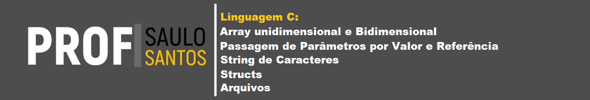

# Biblioteca de Exemplos em Linguagem C

Este repositório contém um conjunto de materiais de apoio para o estudo de **conceitos fundamentais da linguagem C**. O objetivo é apresentar exemplos simples, claros e didáticos que auxiliem estudantes em cursos de graduação a compreender estruturas e técnicas essenciais de programação.

Os conteúdos estão organizados em **arquivos Markdown (`.md`)**, cada um abordando um tópico específico da linguagem.

---

## Conteúdo do Repositório

### 1. Arrays Unidimensionais e Bidimensionais

Apresenta o conceito de **vetores e matrizes** em C, incluindo:

* Declaração e inicialização de arrays
* Acesso e manipulação de elementos
* Percorrendo arrays com estruturas de repetição
* Exemplos práticos com vetores
* Exemplos práticos com matrizes

---

### 2. Passagem de Parâmetros por Valor e por Referência

Explica como funções recebem dados em C e como isso afeta a modificação de variáveis.

Inclui:

* Conceito de **passagem por valor**
* Conceito de **passagem por referência usando ponteiros**
* Diferença entre os dois métodos
* Exemplos comparativos
* Situações em que cada abordagem deve ser utilizada

---

### 3. Strings de Caracteres

Introduz o tratamento de **strings em C**, que são representadas como arrays de caracteres.

O material aborda:

* Declaração e inicialização de strings
* Uso do caractere `'\0'`
* Entrada e saída de strings
* Funções comuns da biblioteca `<string.h>`
* Manipulação básica de texto

---

### 4. Estruturas (`struct`)

Apresenta o uso de **estruturas de dados definidas pelo usuário** para organizar informações relacionadas.

Conteúdos incluídos:

* Definição de `struct`
* Declaração de variáveis estruturadas
* Acesso aos campos de uma estrutura
* Uso de estruturas em arrays
* Passagem de estruturas para funções

---

### 5. Manipulação de Arquivos

Mostra como realizar **operações de leitura e escrita em arquivos** utilizando a biblioteca padrão da linguagem C.

Inclui:

* Abertura e fechamento de arquivos
* Modos de acesso (`r`, `w`, `a`, etc.)
* Escrita em arquivos
* Leitura de dados
* Exemplos completos de programas

---

## Objetivo do Material

Este material foi desenvolvido para:

* apoiar disciplinas introdutórias de **programação em C**
* servir como **referência rápida** para estudantes
* fornecer **exemplos práticos comentados**

Os exemplos foram escritos de forma simples para facilitar a compreensão e o estudo progressivo da linguagem.

---

## Como Utilizar

1. Escolha um dos arquivos `.md` do repositório.
2. Leia a explicação teórica do conceito.
3. Analise os exemplos de código fornecidos.
4. Compile e execute os programas para observar o comportamento.

Sugestão de compilação usando **GCC**:

```bash
gcc programa.c -o programa
./programa
```

---

## Público-Alvo

Este material é destinado principalmente a:

* estudantes de **Ciência da Computação**
* estudantes de **Engenharia**
* iniciantes em **programação na linguagem C**

---

## Licença

Este material é disponibilizado para fins **educacionais**. Sinta-se livre para utilizar, modificar e compartilhar para apoio ao ensino e aprendizagem de programação em C.

